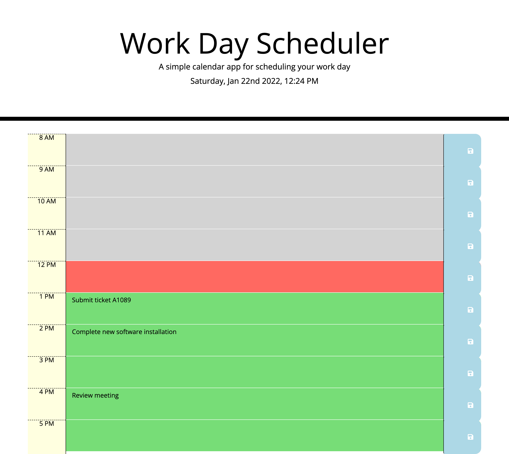

# Updated Tech Portfolio

# Why did I build this project?

To update my tech portfolio. This updated portfolio will include my Project 1 and Project 2 which was collaborative work as well as two exemplary homework assignments.

To also include an updated GitHub profile with pinned repositories featuring Project 2 and two exemplary assignments.
My motivation behind this is to prepare myself to be in a position to start applying for jobs by displaying my skills through my professional portfolio. Therefore having also inlcuded an updated Linkedin account and CV to better transition into a role as a web developer.

# So far I have achieved?

1. To update my tech portfolio successfully. The previous version (https://farhiya1.github.io/TechPortfolio/).

# What I intend to add in the near future?

1. To continue to build on it with the skills I continue to gain. I would like to make it more interactive using Javascript.

# To access this project the following links are provided:

To access Github Repository

1. https://github.com/Farhiya1/UpdatedTechPortfolio

To access Application deployed at live URL

2. https://farhiya1.github.io/UpdatedTechPortfolio/

# Screenshot of deployed application)

1. Screenshot displaying Portfolio (Home Page)

2. Screenshot of About Me Page

3. Screenshot of Projects Page

4. Screenshot of Contact me section
   .

5. Screenshot displaying responsiveness of website
   .

6. Image of me for profile.
   .

7. Screenshot of CV
   .

8. Screenshot displaying project 1 - Events API
   .

9. Screenshot displaying project 2 - Work Planner
   .

10. Screenshot displaying project 3 - Project 2
    .

11. Screenshot displaying project 4 - Weather Dashboard
    .

# References

1. https://www.w3schools.com/css/default.asp
2. https://getflywheel.com/layout/flexbox-create-modern-card-design-layout/
3. https://developer.mozilla.org/en-US/docs/Learn/CSS/CSS_layout
4. https://birmingham.bootcampcontent.com/university-of-birmingham/
